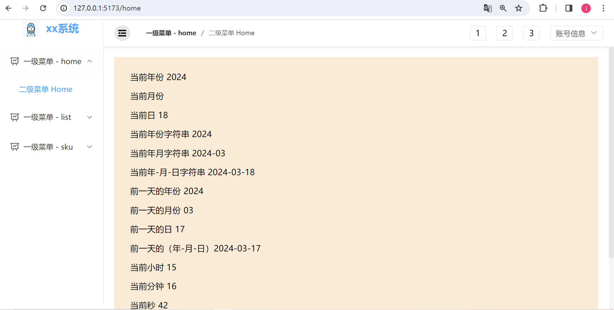

# 后台管理系统简介

本项目采用`vue3 + vite4 + element-plus + scss + pinia2 + vue-route4`，提供了一个简洁、高效的后台管理系统！这个开源项目旨在提供一个简洁、高效的后台管理解决方案。以下是一些关于该系统的重要信息：

## 特点和优势

- **简洁而直接**：系统骨架已经搭建好，使您能够专注于业务逻辑的实现而不必从头开始构建整个后台管理系统。

- **自动生成导航菜单路由**：创建路由时，系统会自动生成相应的导航菜单，包括登录和退出功能，以及logo和标题的显示。

- **折叠/展开功能**：系统支持折叠显示logo，在展开时显示标题和logo，提供更灵活的界面操作体验。

- **免费使用**：我们鼓励自由使用和定制，希望为开发者社区提供一个有益的工具。

- **自定义接口**：您可以轻松添加自定义接口，以满足特定业务需求。

- **无需联网**：系统完全独立运行，不需要依赖网络或模拟数据。

- **主打简洁与免费**：本项目主打一个简约、易用且免费的后台管理系统，让您专注于业务本身而非繁琐的系统搭建工作。
- **内置年月日插件**：参考[dayjs](https://www.npmjs.com/package/get-year-month-day-hour-minute-second)插件，实现年月日时分秒的获取，无需再手动进行获取。
## 如何使用

您可以通过以下步骤开始使用我们的后台管理系统：

1. 克隆或下载项目源代码。
2. 安装依赖包，执行命令`npm i`。
3. 运行项目，执行命令`npm run dev`。
4. 访问项目，打开浏览器输入`http://127.0.0.1:5173/`。
## 页面介绍
### 登录页

### 主页页

### 个人信息和退出登录页

### 导航栏折叠

### 导航栏展开

## 贡献

如果您对该项目感兴趣并愿意贡献代码或提出改进建议，请参考我们的贡献指南（CONTRIBUTING.md）。

## 联系我们

如果您有任何疑问或反馈意见，欢迎通过GitHub上的Issue页面与我们联系。

感谢您选择xx后台管理系统，希望它能为您的工作带来便利和效率！